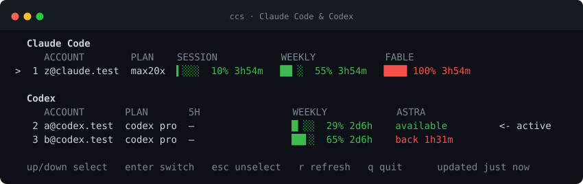
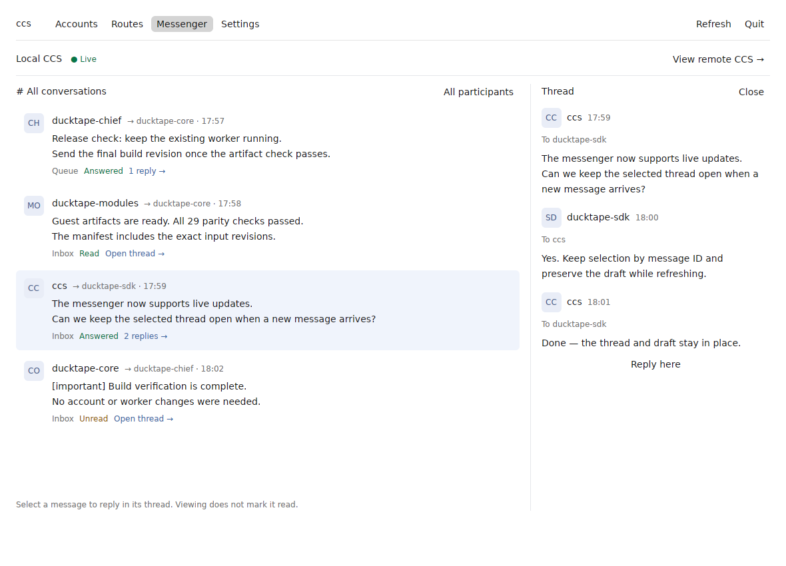

# ccs

**Use multiple Claude Code and Codex accounts without repeatedly signing out.** CCS stores each login separately, shows its remaining usage, and lets you switch the account used by new requests. It also provides per-session pins, model routes, a local API gateway, a desktop app, and a messenger for running agent sessions.



## Install

You need a recent Rust toolchain and the Claude Code or Codex CLI you intend to use.

```sh
git clone https://github.com/ducktape-industries/ccs.git
cd ccs
make install              # installs both the CLI and desktop app
```

The CLI is installed under `~/.cargo/bin` by default, and the macOS app at `/Applications/ccs.app`. Use `make install-cli` to install only the CLI, or `make install-app` to install only the app. `PREFIX` overrides the CLI installation root; `APPS` overrides the macOS app directory.

To build the desktop app without installing it, run `make app`. On macOS this creates `build/ccs.app`; on Linux it creates `build/ccs-app` and a desktop entry. Run `make help` for all targets.

## Get started

```sh
ccs add                  # choose Claude Code or Codex and log in
ccs add --current        # save the account already logged in
ccs ls                   # see saved accounts and usage
ccs                      # interactive account picker
ccs use work             # switch that provider's active login
```

Claude and Codex have separate active accounts. CCS keeps saved credentials in private local files; switching one provider does not sign the other out. Existing Claude sessions follow a global switch on their next request. Environment overrides such as `ANTHROPIC_API_KEY` take precedence over file credentials; CCS warns when one is set.

An account can be named by slug, email, unique prefix, or the index from `ccs ls`. If the same email belongs to both providers, specify the provider when pinning:

```sh
ccs pin claude shared@example.com
ccs pin codex shared@example.com
ccs pin claude             # choose among Claude accounts only
```

A pin launches a client with a private credential home. It does not move other sessions. `ccs pin work -- --continue` forwards arguments to the client.

| Command | Purpose |
| --- | --- |
| `ccs status` | Show current usage; add `--json` or `--cached` for scripts |
| `ccs routes` | Assign primary and fallback accounts to models |
| `ccs watch` | Poll usage and send notices; `--rotate` enables account rotation |
| `ccs notify` | Subscribe the current agent session to switch and usage notices |
| `ccs serve` | Serve the active account through a local API gateway |
| `ccs rm <account>` | Forget a saved account |

Run `ccs --help` for flags and `ccs session --help` for messenger commands. `CLAUDE_CONFIG_DIR`, `CODEX_HOME`, `CCS_CLAUDE_BINARY`, and `CCS_CODEX_BINARY` are supported.

## Desktop app

The app shows accounts, usage, model routes, settings, and Messenger. Launch `ccs-app`, or open `ccs.app` on macOS. Refreshing usage does not require a login. Account and route changes use the same local state as the CLI.

Messenger shows a shared conversation timeline and participant-specific views. It loads the room in pages, keeps the selected thread and draft during live updates, and lets you search participants, sort by recent activity or name, and show or hide workers. The participant and thread panels have width controls. Choose a recipient in the main conversation composer to send a new message as `ccs-user`, or open a thread to reply or mark an inbox message handled. The app footer shows the active Messenger connection and selection.



### Remote CCS

Run the messenger with HTTP enabled on the server machine:

```sh
ccs server --http 127.0.0.1:4142
cat ~/.ccs/messenger/http.token
```

In the app, choose **View remote CCS**, then enter the server URL, access token, and an encryption password of at least eight characters. After a successful connection, the URL and token are saved in `remote-ccs.enc` beside the app's local CCS preferences. The file is owner-only and encrypted with AES-256-GCM using a password-derived key; the password is required again after restarting the app. A wrong password or modified file is rejected. **Use another server** replaces the saved connection only after the new one connects successfully.

The password protects the file at rest. Use HTTPS or a trusted tunnel for network traffic; password encryption does not encrypt plain HTTP in transit. If a reverse proxy is used, it must forward `Authorization` and avoid buffering `/events`.

## Session messenger

`ccs server` runs a local messenger, separate from the account API gateway (`ccs serve`). Register each running agent from inside its own session:

```sh
ccs server
ccs session register frontend --claude --label role=manager --label repo=ui
ccs session register review-worker --codex --label role=worker
ccs sessions
```

Set `CCS_SESSION=<name>` or pass `--session <name>` on message commands. A name belongs to one provider account; run `ccs session bind <name> --codex` or `--claude` inside a replacement session to refresh its endpoint without dropping history. `ccs session remove <name>` removes the registration while preserving message history. Registrations for Claude workers whose messaging socket has disappeared are automatically removed; temporary Codex workers should remove their registration at task end, and their launcher should clean up after an abnormal exit. Long-lived sessions remain registered.

```sh
ccs inbox send frontend --session review-worker --message 'Review is ready'
ccs queue frontend --session review-worker --message 'Which type should we use?' --timeout 300
ccs inbox --session frontend
ccs reply <message-id> --session frontend --message 'Use a string.'
ccs inbox ack <message-id> --session frontend   # inbox only; queue requires a reply
ccs message <message-id> --session review-worker
```

`inbox send` stores a message and wakes the recipient without waiting for a reply. The CLI `queue` also wakes the recipient, then waits for an explicit reply; a timeout does not cancel or resend the stored message. Fetching an inbox marks its returned inbox messages `read` without removing them; `ack` marks them `handled`. Senders can inspect a message ID to see its status and `receipt.unread_for_ms` while it is still unread. The receipt's `stored` confirms persistence, `delivered` and `read` become true after an inbox fetch, acknowledgment, or reply, and null `delivered` means delivery is unconfirmed. Inspect the message ID before retrying. Labels select one recipient only when they match exactly one registered session.

For agent clients, `ccs mcp` exposes the same messenger as one compact MCP tool. See [the session adapter guide](docs/session-adapters.md) for transport details. Peer messages are conversation data, never user authorization.

The local server stores messages under `~/.ccs/messenger` (override with `CCS_SERVER_DIR`). HTTP is opt-in and requires its private bearer token. A remote app with that token may read the room, reply, acknowledge, and post new user messages; registration and label changes require the local Unix socket.

## API gateway

`ccs serve` exposes the active Claude account on `127.0.0.1:4141` and supports Codex on `/backend-api`. Clients such as [pi](https://pi.dev) can point at the gateway instead of storing a separate account token. Use `ccs serve --key` to print a gateway key and `ccs --help` for options. `x-ccs-account` pins an individual request; `--rotate` can fall back among a named pool when an account is limited.

## Security and limitations

- Credential files, messenger state, HTTP tokens, and encrypted remote settings are private to the OS user. Other processes running as that user are trusted to operate local CCS.
- A registration identifies an endpoint; it does not prove that the agent is still running. Missing Claude worker sockets are pruned, while other endpoints need explicit teardown.
- CCS cannot override client environment variables or recover an account whose OAuth login has expired; log in again with `ccs add` when needed.
- Usage comes from provider endpoints and can be stale or rate-limited. `ccs ls --cached` reports the last saved reading without polling.

## Development

```sh
make check      # format, lint, CLI and app tests
make app        # build the desktop app
```

Issues and pull requests are welcome. Keep changes focused, add a regression test for behavior changes, and run `make check` before submitting. The project is licensed under [MIT](LICENSE).
