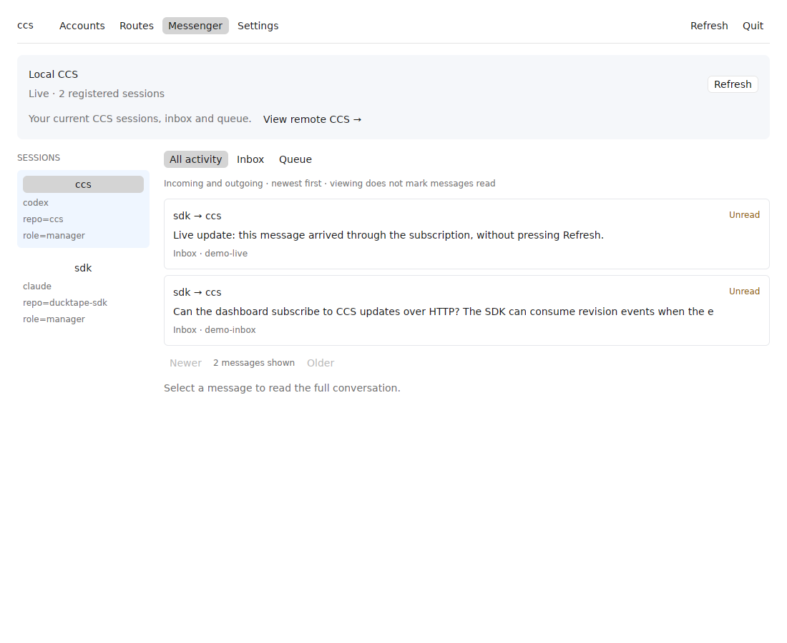
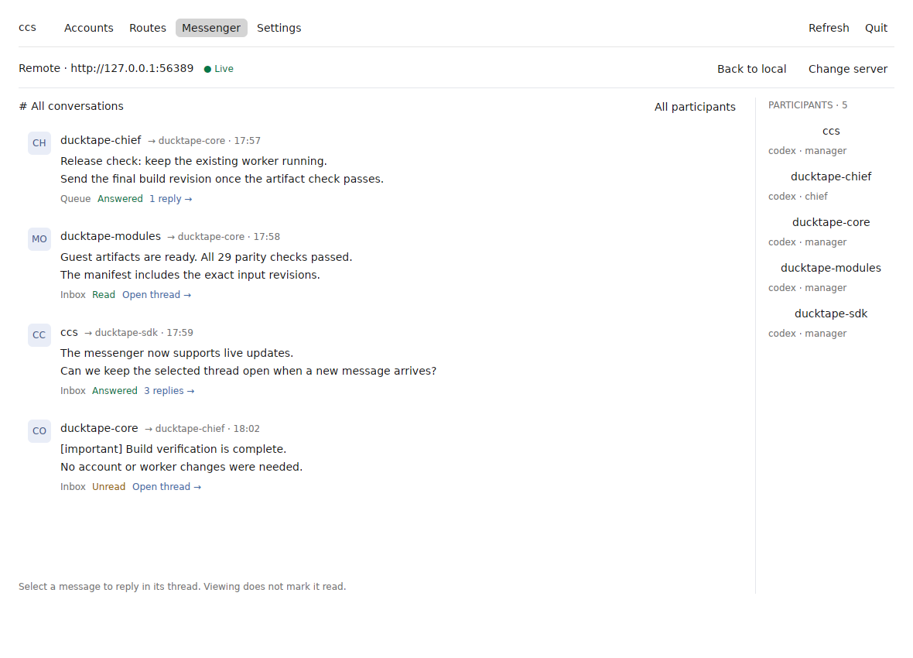

# ccs

Switch Claude Code and Codex accounts, and see what each one has left
before you commit to it.


If you run more than one Claude subscription you know the shape of this problem.
You are deep in something, the weekly limit lands, and the only road to your
other account is `/login` — which signs you out everywhere, drops whatever
sessions you had going, and tells you nothing about whether the account you are
moving to has any room left either. An hour later you do the whole thing again in
reverse.

`ccs` keeps every account logged in at once, shows you where each one stands, and
moves between them in place. Claude Code sessions that are already running follow
along on their next request. Nothing restarts, and nothing gets signed out.

## What it is actually good at

**Seeing before switching.** Claude Code and Codex have separate sections with
columns suited to their usage limits. Claude shows its session, weekly and
model-specific windows. Codex shows its shared quota and every additional pool
the API reports, with all available windows and reset countdowns. You can see
which account has room before switching.

**Never logging in again.** Each account is stashed with its own credentials.
Switching installs one of them over the live file; it never signs the other one
out. Going back is another switch, not another login.

**Live sessions.** A Claude Code switch reaches sessions already running, mid-task,
without a restart. That is the difference between "I'll switch accounts" being a
two-second decision and being a five-minute interruption.

**Notices into a session.** A Claude Code session that runs `ccs notify` from
inside itself gets told things in its own conversation: `switch` (which account
it is now on, so the model knows its prompt cache just went cold), and — while
`ccs watch` is running — `session-high` (the account in use has crossed 90% of
its five-hour window), `session-reset` (an account's window came back, and
whether its weekly resets sooner than the active one's) and `weekly-reset`.
Name the kinds you want, or none for all of them; `ccs notify off` stops them.
Usage polling for saved accounts shares a disk cache and an OS file lock across the CLI, picker,
watcher and app. Successful readings are reused for five minutes without changing
their timestamps. Accounts are polled sequentially: a usage HTTP 429 pauses that
provider's remaining accounts for 10 minutes, doubling on repeated limits up to
one hour (or longer when an integer `Retry-After` asks for it). The other provider
can still update. Cooldowns survive process restarts; failed requests retain the
last good reading. The app's Refresh button updates usage without reloading model
catalogs. This is usage-endpoint throttling, not an inference-quota reset.

`ccs watch --every 300 --high 90` are the defaults. A session that bypasses
permission prompts holds a notice for review unless the sender attests the
same mode: subscribe from such a session with `ccs notify --bypass`.

**Rotation.** `ccs watch --rotate agent,work,robin` also switches for you: when
the account in use is one of those and its session has run high (or its weekly
is spent), the pooled account whose weekly window resets soonest and still has
room takes over — quota about to be forfeited is burned first. An account in
use that is not in the pool was chosen by hand and is never touched. Running
sessions follow the switch like any other, and hear a `switch` notice if they
asked.

**A gateway for other tools.** `ccs serve` puts the Anthropic Messages API on
`127.0.0.1:4141`, answering as whichever account is in use. Anything that speaks
the API — [pi](https://pi.dev) through its `models.json`, say — gets every
account you have stashed and never logs in itself; `ccs use`, the picker and
`ccs watch --rotate` move it along with your sessions. With a `--rotate` pool of
its own, a request the account in use is too limited to answer is quietly sent
again as the next pooled account. A session that would rather not move sends
`x-ccs-account: <account>` on each request and is pinned to that account, the
way `ccs pin` pins a Claude Code terminal. See below.

**Codex accounts too.** Choose Codex in `ccs add` to stash a ChatGPT login for Codex
CLI the same way, and the table, picker, watcher, menu bar app and gateway
take it from there: what each Codex account has left, a click to switch
`~/.codex/auth.json`, rotation among Codex accounts, and pi or Aside's
`openai-codex` provider served through the gateway. Codex's login and Claude
Code's are two slots, each with its own account in use.

**Pinning.** One session on one account, every other session left where it is.
This is the feature that changes how you work — see below.

## Model routes in the terminal

Press `m` in the account picker to configure a model route for the highlighted
account's provider, or run `ccs routes` (`--claude` / `--codex` skips the provider
menu). Models are loaded from the same provider APIs as the desktop app.

- Use arrows and Enter to choose a model, `/` to filter, or `r` to reload.
- Press `i` to enter an exact model ID or a prefix ending in `*`.
- Select accounts with Space in priority order: first is primary, then fallbacks.
  Left/Right moves a selected account earlier/later. Enter saves; Esc goes back.

Saved models stay available when a catalog request fails or a model disappears.
Saving updates only that provider/model route in `routing.json`, shared with the
desktop app and gateway. It does not switch either provider's active login.
Codex model discovery uses the client version in its local `models_cache.json`;
open Codex once if that file has not been created yet.

## Install

You need a Rust toolchain. Then:

```sh
git clone https://github.com/orthory/ccs
cd ccs
make install
```

That builds a release binary and puts `ccs` on your `PATH` under `$CARGO_HOME/bin`.
Somewhere else:

```sh
sudo make install PREFIX=/usr/local
```

`make help` lists the rest — `make check` runs formatting, clippy and the tests,
`make uninstall` takes it back off.

## Getting your accounts in

Start with the one you are already signed in as, then log in to the others:

```sh
ccs add --current    # choose Claude Code or Codex, then stash its current login
ccs add              # choose a provider, then log in to another account
ccs add              # ...and another
```

`ccs add` first opens a provider menu. Arrows or `j`/`k` select Claude Code or
Codex; Enter continues and Esc or `q` cancels. It then runs `claude auth login`
or `codex login` against a throwaway config directory, keeps the credentials it
mints, and destroys the directory. The account you are currently
using is never touched — no logout, no re-login, and sessions running against it
carry on straight through the login you are doing in the next window.

Steer Claude's login page with `--email <address>`, `--console` (Console billing rather
than a subscription), or `--sso`. Stash under a name of your choosing with
`--name <slug>`; otherwise the slug comes from the email.

After that you are done logging in. `ccs use` moves between stashed accounts
directly.

## Codex accounts

```sh
ccs add --current   # choose Codex to stash its current login
ccs add             # choose Codex to log in to another account
```

Codex accounts have their own section in the picker and `ccs ls`.
`ccs use` installs the selected account into `~/.codex/auth.json` (or `$CODEX_HOME`'s).
Use Codex's `/status` to check an existing session after switching; if it still
shows the previous login, resume the session. Claude Code's slot is untouched,
and the other way round: `ccs ls` marks one account in use per provider, and
`ccs status` offers Claude Code, Codex, or both. Commands naming an account,
such as `use`, `pin` and `rm`, take their provider from that account.

This integration reads Codex's file credentials. If your Codex uses an OS
credential store, select `cli_auth_credentials_store = "file"` in its config
and log in there before choosing Codex in `ccs add --current`. See
[Codex authentication](https://developers.openai.com/codex/auth/).
`ccs pin` selects file credentials for its Codex launch.

Codex shows the reported shared quota windows and a model availability column
when the backend supplies one. `Astra` appears alongside those windows, in the
same place that model-specific limits occupy in the Claude section. Its cell
says `available`, `unavailable`, or `back 1h30m` when a future availability time
is reported. It adds `credits unlock` when the response says credits would
provide access. Missing availability is `unknown`; an elapsed countdown never
overrides the backend's availability flag.

Astra's availability is distinct from a percentage-based quota. No separate
GPT-5.6 or Astra percentage is invented. Spark is hidden from terminal tables,
text status and switch warnings. JSON and the usage cache retain its readings,
along with `model_usage` metadata for every reported model. Other named quota
pools appear on continuation rows with a `POOL` column when needed. Every
reported window is retained, including both five-hour and weekly windows when
present. The `5H` column is always visible, showing `—` when the response does
not include that window; a dash does not imply zero usage or unlimited access.
The backend describes quota windows
in its [usage response schema](https://github.com/openai/codex/blob/main/codex-rs/codex-backend-openapi-models/src/models/rate_limit_status_payload.rs).

Old cached Codex readings that lost a named pool's window duration appear under
`CACHED WINDOW` until the next poll replaces them. Refresh with `r` in the picker
or run `ccs watch` to obtain the complete readings.

Codex accounts can also be pinned and can receive usage notices:

```sh
ccs pin codex-work                    # launch Codex on this stashed account
ccs pin codex-work -- resume --last   # resume within that pin's history
```

The account determines which client `ccs pin` launches. A Codex pin sets
`CODEX_HOME` to `ccs/pens/<account>/`, keeps `auth.json` private, and links
`config.toml`, `AGENTS.md`, skills, plugins, rules, prompts and named
`*.config.toml` profiles to the original Codex home. These are Codex's own
settings and skills; Claude configuration is not translated. Conversation
history, databases, locks and other runtime files use the pin by default; explicit
paths in your Codex configuration still apply. A later
launch with the same account reuses that home. `ccs rm` removes matching
pinned credentials while preserving Codex conversations.

Inside a Codex session, have the agent run:

```sh
ccs notify                           # detect this Codex thread and subscribe
ccs notify session-high              # or only the high-usage notice
ccs notify off                       # unsubscribe this thread
ccs status --codex --cached           # last account usage reading, no API call
ccs status --codex --cached --json    # includes polled_at for scripts
ccs status --codex                    # refresh only Codex's reading
```

Run `ccs watch` in another terminal to poll and generate usage notices. The
watcher sends `session-high` for the account active in its credential home,
and `session-reset`/`weekly-reset` for that provider's accounts. Notices and
rotation use shared windows; additional named pools are shown in usage views. Run the
watcher with a pin's `CODEX_HOME` to track that pin's active account. Switch
notices go only to sessions registered against the home that changed.

Codex notices use `codex queue --thread … --message …`, with the thread ID
Codex exports as `CODEX_THREAD_ID`. They are queued conversation messages,
not a native status-line widget. Registration verifies that the installed
CLI supports this command (verified with 0.153.4); older builds get a clear
error and can still use cached status. Queue failures are reported and keep
the subscription for future events. `--bypass` is only for Claude's inbox;
Codex keeps its session permissions.

In a terminal, `ccs notify` and `ccs serve --key` offer a provider menu too.
Without a terminal, notices detect the calling client from its session
environment; if both clients' variables are inherited, select `--codex` or
`--claude` explicitly. Cached status uses the credentials in that home, so it
reports the pinned account even when the global active pointer differs.
These readings track subscription windows, not individual-turn token counts.

For scripts, `--claude` and `--codex` bypass provider menus. Adding an account
without a terminal requires one of these selectors. JSON or piped status shows
both providers by default; piped `ccs serve --key` retains its Claude default,
with `ccs serve --key codex` selecting Codex. `ls`, `watch` and `serve` operate
across providers without a provider menu.

## Everyday use

Run `ccs` with no arguments and you get the picker. Accounts are grouped by
provider, then email. The numbers shown by `ccs ls` use the same order for
`use`, `pin` and `rm`; prefer stable slugs in scripts.

For example, the Claude section:

```
  Claude Code
     ACCOUNT              PLAN    SESSION           WEEKLY            FABLE
>  1 you@example.com      max20x  ▍░░░  10% 3h54m   ██▏░  55% 6h24m   ████ 100% 6h24m   <- active
   2 you+alt@example.com  max5x   ░░░░   0%         ▋░░░  18% 2d11h   ▉░░░  22% 2d11h
   3 team@example.org     pro     ██▍░  61% 1h44m   ███▌  88% 5d19h   ██▊░  70% 5d19h

  up/down select   enter switch   esc unselect   r refresh   q quit      updated just now
```

The Codex section shows its quota windows and model availability:

```text
  Codex
     ACCOUNT              PLAN       5H                WEEKLY            ASTRA
   4 you@example.com      codex pro  —                 █▏░░  29% 2d11h   available         <- active
   5 you+alt@example.com  codex pro  —                 ██▌░  65% 2d11h   back 1h30m
```

Additional pool names and model IDs come from the API. Pool rows belong to the
account above them; only accounts are selectable. Switching to an account with
an unavailable model prompts for confirmation, just as a spent quota does.
Watcher notices and rotation continue to follow shared quota windows.

Arrows or `j`/`k` move and `home`/`end` jump to the ends. The table carries the
readings; the footer carries keys and confirmations. `ccs status` shows detailed
readings separately. `enter` asks before it does anything and names restrictions:

```
  you@example.com on Claude Code: no Fable left. Switch anyway? [y/n]
```

Answering yes switches, and the picker stays where it is — the active marker moves
to the row you picked and the footer says what happened:

```
  Claude Code
     ACCOUNT              PLAN    SESSION           WEEKLY            FABLE
   1 you@example.com      max20x  ▍░░░  10% 3h54m   ██▏░  55% 6h24m   ████ 100% 6h24m
>  2 you+alt@example.com  max5x   ░░░░   0%         ▋░░░  18% 2d11h   ▉░░░  22% 2d11h   <- active
   3 team@example.org     pro     ██▍░  61% 1h44m   ███▌  88% 5d19h   ██▊░  70% 5d19h

  switched to you+alt@example.com
```

Nothing is re-fetched to draw that: a switch spends nobody's limits, so the
readings on screen are as true after it as they were before. Switch again from
the same table if the first one was wrong — the terminal you leave the picker in
still gets the record of where you ended up.

`esc` backs out one step at a time. From a question it takes you back to the list;
from the list it puts the selection away entirely, which leaves `enter` with
nothing to act on:

```
  Claude Code
     ACCOUNT              PLAN    SESSION           WEEKLY            FABLE
   1 you@example.com      max20x  ▍░░░  10% 3h54m   ██▏░  55% 6h24m   ████ 100% 6h24m   <- active
   2 you+alt@example.com  max5x   ░░░░   0%         ▋░░░  18% 2d11h   ▉░░░  22% 2d11h
   3 team@example.org     pro     ██▍░  61% 1h44m   ███▌  88% 5d19h   ██▊░  70% 5d19h

  up/down select   r refresh   q quit      updated just now
```

Move again and the selection comes back. One more `esc` from there leaves the
picker; `q` and `ctrl-c` leave from anywhere.

If you already know where you are going, skip the picker:

```sh
ccs use work            # slug, email, unambiguous prefix, or the index from `ccs ls`
ccs use 2
ccs ls                  # the same table, printed and gone
ccs status              # just the account in use, in detail
```

`ccs use` switches straight away and is the one that leaves you at your prompt;
the picker is where you switch and then keep looking. It only stops to ask when
the account you are switching to has a limit already at 100%, and `--force` skips
even that.

## Pinning a Claude Code session to one account

A switch is global — every session follows it. Sometimes that is exactly wrong:
you want this terminal on the work account and everything else left alone. That
is `ccs pin`:

```sh
ccs pin                     # pick from the table, then launch
ccs pin work                # skip the picker
ccs pin work -- --continue  # anything after `--` is handed to Claude Code
```

It picks an account the same way `ccs` does, then starts Claude Code on it —
which is the one thing the picker cannot stay up for, because the session takes
the terminal. That
session is the only thing that moves. Every other session stays on the account in
use, and a later `ccs use` leaves the pinned one exactly where it is. Nothing
displays the account on its own. `ccs status` inside the session names it, and
`CLAUDE_CONFIG_DIR` points at the pen — which is named for the account — so a
status line can keep the answer in front of you without asking the network.

Run several at once, one terminal each, and you are working three accounts in
parallel with three separate limit budgets.

A pi session going through the gateway has no terminal of its own to pin, so it
pins each request instead: an `x-ccs-account: <account>` header, naming an
account the way `ccs use` does — slug, email, or an unambiguous prefix of
either — sends that request out as that account, whatever is in use. `ccs use`
leaves such a session where it is. The pin is strict: a pinned account that is
limited answers `429`, rather than falling over to the `--rotate` pool, because
the session asked for that account and not for whichever has room. A header
naming no account is a `400`, and the header itself never goes upstream.

### What a pinned session shares, and what it doesn't

A pinned session is a normal session in every way but one. It gets a *pen* — a
configuration directory of symbolic links back to your real one, whose only file
of its own is the credentials — and `CLAUDE_CONFIG_DIR` points at it.

**Shared, live, with every other session:** settings, skills, plugins, agents,
slash commands, MCP servers, project trust, conversation history, todos — and the
global `.claude.json` alongside them. These are links, not copies, so a pen never
drifts from what it mirrors, and a skill you add inside a pinned session is a skill
every session has. There is no syncing step because there is nothing to sync.

**The pen's own, shared with nothing:** the credentials. That is the entire point
of the pen, and it is the only real file in it. A `ccs use` elsewhere rewrites the
live credentials and leaves the pen's standing.

**Also not mirrored:** the account stash itself and the credential write lock. The
stash stays reachable from inside a pen anyway — a pen records the configuration it
was cut from, so `ccs` inside a pinned session reads your real accounts, and
`ccs use` in there re-pins that one session rather than moving everybody. `ccs rm`
takes an account's pen away with it.

If Claude Code ever replaces one of those links with a real file of its own, the
pen keeps that file from then on rather than clobbering it back to a link.

## Using the accounts from pi

```sh
ccs serve                         # or: ccs serve --port 4141 --rotate agent,work
```

It prints the fragment to paste into pi's `~/.pi/agent/models.json`:

```json
{
  "providers": {
    "anthropic": {
      "baseUrl": "http://127.0.0.1:4141",
      "apiKey": "!ccs serve --key"
    }
  }
}
```

That is the whole of it. Overriding only `baseUrl` on the built-in provider keeps
every Claude model pi already knows about, and the key is fetched by running the
command, so nothing secret sits in the file. A client launched from the desktop
rather than a shell may not have `~/.cargo/bin` on its `PATH`; spell the command
out as `!/Users/you/.cargo/bin/ccs serve --key` if the model shows as
unavailable. [Aside](https://aside.com) reads the same file at
`~/.aside/u/0/models.json`, and needs exactly that. Each request goes out as the account
in use, with its access token refreshed on the way when it has expired, and the
answer is streamed back as it arrives.

The key is `sk-ant-oat-ccs-` and 32 random hex digits, minted once into
`~/.claude/ccs/gateway.key`. The prefix is what pi keys on to treat a key as an
OAuth token — so pi itself sends the bearer header, the OAuth betas, and the
Claude Code identity line at the head of the system prompt, and the gateway has
no reason to read a body. The suffix is what stops another process on the same
machine from spending your subscription: a request without it gets a `401` and
never leaves the machine.

A request the API turns away with a `429` is, when `--rotate` names a pool, sent
again as the first pooled account not yet found limited, before a byte has
reached the client. Without a pool, or on a request pinned with `x-ccs-account`,
the `429` is relayed as it is. A `401` on a
token this tool thought was fresh is taken for a session having refreshed the
live credentials underneath it; the copies are brought level and the request
sent once more.

Only `127.0.0.1` is listened on, and only paths under `/v1/` (Anthropic) and
`/backend-api/` (Codex) are relayed.

The Codex side works the same way with a second key. pi's built-in
`openai-codex` provider is told `"baseUrl": "http://127.0.0.1:4141/backend-api"`
and `"apiKey": "!ccs serve --key codex"`; the startup snippet prints both
providers. That key is shaped as a token, because pi reads the ChatGPT account
id out of the key it is given and sends it as a header: the gateway checks the
whole string, then puts the real account's token and id on the request. pi
opens a socket first for Codex; the gateway refuses the upgrade and pi falls
back to server-sent events for that session.

## The app

```sh
make install-app      # macOS: /Applications/ccs.app; Linux: ~/.local/bin/ccs-app
open /Applications/ccs.app
```

One window on every platform: every account with its bars and reset times,
click one to switch, and a spent account asks first. Below them the two
switches. **Gateway** serves the API on the port you set. **Rotate
automatically** hands the watcher a pool of the accounts you tick, and
**Notifications** turns its `session-high`, `session-reset`, `weekly-reset`
and `rotate` lines into system notifications. **Launch at login** keeps a
LaunchAgent on macOS and an autostart entry on Linux, and takes effect from
the next login. All of it is remembered
under `ccs/app.json`.

On macOS there is a menu bar item too: the active Claude account's session on
the bar, and the window on a click.

The app links `ccs` as a library, so there is one process: the watcher runs on
a thread of its own and is the one thing that polls, the gateway's listener
and desk run on threads of the same process, and the window reads what the
watcher last wrote down. Quitting takes the gateway down with it. It is
written with [GPUI Kit](https://github.com/longbridge/gpui-kit), pinned to
0.6.1. The native dashboard separates account usage, model routes and settings.
Usage cells adapt to the number of reported limits and the window width, including
new model-scoped limits. Model availability flags are not shown as usage.
The window fits four to eight accounts by default, with six combined Claude and
Codex accounts fitting without scrolling at the minimum width. macOS window
controls share a single compact row with the tabs; clicking the menu bar item
brings the window to the active desktop.
`make app` builds the bundle, `make test-app` runs its tests, and `make lint-app`
runs Clippy. Iced, the Ice compiler and generated UI sources are no longer used.

### Model routing in Claude Code

In **Model routing**, enter a model ID or a prefix ending in `*`, then select
its primary account and optional fallback accounts in order. For example:

| Model pattern | Primary account |
| --- | --- |
| `claude-opus-*` | account A |
| `claude-fable-*` | account B |

Launch a routed Claude Code session from your project:

```sh
ccs claude -- --model fable
# Existing sessions can be resumed with normal Claude Code flags:
ccs claude -- --continue
```

CCS starts a session-owned loopback proxy on an available port and passes its
endpoint and local credential to Claude Code. No shell profile or global Claude
Code login is changed. Every request is routed by its actual `model` field:
a Fable parent uses B while its Opus subagent uses A, including concurrent
requests. `/model` changes apply on the next request. `ccs pin` remains the
alternative for a session that must stay on one account.

Rules live in `~/.claude/ccs/routing.json` (under `CLAUDE_CONFIG_DIR` when set).
Both `ccs claude` and the dashboard/`ccs serve` gateway reload them per request,
so saving a route does not interrupt an in-flight stream. Exact IDs win over
prefixes; the longest prefix wins. Unmatched or model-less requests use the
active account and the gateway's ordinary pool. A matched rule tries **only**
its own accounts, in order, on HTTP 429; it never falls back into another model's
account pool. Invalid files or missing/provider-mismatched targets fail closed.
CCS does not manufacture additional quota; provider-side shared limits still apply.

The proxy preserves request bodies and streaming responses, substitutes the
selected account's OAuth token, and uses the existing token refresh handling.
Claude Code's custom-endpoint restrictions also apply, including Remote Control
availability; see [Claude Code environment variables](https://code.claude.com/docs/en/env-vars).

Verification without real inference:

```sh
python3 scripts/verify-claude-routing.py
```

This launches your installed Claude Code against a local SSE stub with a temporary
configuration and test token, drives a real Opus Agent tool call from a Fable
parent, and checks that both models inherit the local endpoint and OAuth headers.
`CCS_LOG_REQUESTS=1 ccs claude` enables request/account diagnostics on stderr.

Core tests separately verify account selection, isolated credentials, retries,
rule reloads and unchanged request bodies. This local test does not verify live
subscription entitlement or the upstream acceptance of a particular account.


## How it works

**Switching a live session.** Claude Code checks the mtime of its credentials file
each time it resolves credentials, and drops its in-memory auth when the file has
moved underneath it. `ccs` writes the replacement to a sibling temp file and
renames it into place, so a reader sees either the old file or the new one and
never a half-written one — and the rename freshens the mtime that running sessions
are watching. That is the whole trick. There is no daemon and no IPC.

**On macOS, where the credentials are not a file.** Claude Code keeps them in the
login keychain there, reads that in preference to the file, and writes the file
only when the keychain turns it away — so a switch written to the file would be a
switch nothing reads. `ccs` writes the item instead, under the name Claude Code
gives it: `Claude Code-credentials`, keyed to your login name. A session with no
credentials file to watch compares the token in the keychain instead, so a switch
reaches running sessions the same way it does anywhere else.

The item is namespaced by configuration directory — `CLAUDE_CONFIG_DIR` decides
which — which is what gives every pen credentials of its own, and what keeps a
pinned session pinned. `ccs rm` takes an account's item away with its pen, and an
interrupted `ccs add` leaves none behind.

**Not fighting over the file.** Claude Code takes a lock beside the credentials
file when it refreshes tokens. `ccs` takes the same lock, so a switch can't
interleave with a refresh and lose one of the two writes.

**Keeping stashed tokens alive.** This is the part that is easy to get wrong.
Claude Code refreshes access tokens in place, so a stashed copy goes stale the
moment its account is used, and a refresh can *rotate* the refresh token — which
makes the copy you were holding worthless. So `ccs` folds the live tokens back into
the stash on the way out of an account, refreshes any stashed token that has
expired before polling it, and writes down whatever comes back before doing
anything else with it. When the account it refreshed is the live one, the
credentials file gets the new token too, so running sessions are never left holding
one that has been superseded.

**Reading usage.** The limits come from the same OAuth endpoint Claude Code uses
for `/status`, one request per stashed account. The columns are built from whatever
the API reports rather than from a fixed list, so a newly scoped model turns up as
its own column without a change here.

**Leaving the reading behind.** Every poll is written down on the way past, one
file per account under `ccs/usage/`, stamped with when it was taken. Nothing in
`ccs` reads them back — they are there for anything that has to show where an
account stands far more often than a poll can be afforded, a status line above a
prompt being the case they exist for. The limits are stored exactly as the
endpoint reported them, so a reader draws whatever windows it finds rather than
knowing a list of them. A failed poll leaves the last reading standing instead of
blanking it, and the stamp is what says whether it is still worth believing;
`ccs status` is the cheapest way to freshen one, costing the account in use a
single round trip. A reading looks like this, and nothing but the endpoint decides
how many limits are in it:

```json
{
  "polled_at": "2026-08-28T02:31:04Z",
  "limits": [
    { "kind": "weekly_all", "percent": 55.0, "severity": "normal",
      "resets_at": "2026-09-01T14:00:00Z", "scope": null },
    { "kind": "weekly_scoped", "percent": 100.0, "severity": "critical",
      "resets_at": "2026-09-01T14:00:00Z",
      "scope": { "model": { "display_name": "Fable" } } }
  ]
}
```

**Polling.** The picker polls with the screen already up — on open, on `r`, and
every ten minutes on its own — so the list is never taken away to fetch. An
unattended poll waits for a lull rather than freezing the list under you, the
footer says how old the reading is, and a poll that fails says so there and leaves
the last good reading standing. The interval is long because each poll costs a
request per account against an endpoint that rate-limits. The countdowns don't wait
on it: they are recomputed from the reset instants every time the screen is
painted, so only the percentages are as old as the footer says.

## Commands

| command | what it does |
| --- | --- |
| `ccs` | the picker |
| `ccs ls` | every stashed account and what it has left |
| `ccs use <account>` | switch that provider's login |
| `ccs pin [<account>]` | start a session confined to one account |
| `ccs add` | choose a provider, then log in and stash another account |
| `ccs add --current` | choose a provider and stash its current login |
| `ccs rm <account>` | forget a stashed account |
| `ccs status` | choose a provider or both; show usage and reset times |
| `ccs status --codex --cached` | this Codex home's last reading, without polling |
| `ccs notify [<kind>...]` | have notices delivered into the calling session |
| `ccs watch` | poll every account and raise notices; `--rotate` switches too |
| `ccs serve` | serve the API on loopback as the account in use |
| `ccs serve --key` | choose whose gateway key to print |

`<account>` is a slug, an email, an unambiguous prefix of either, or the index from
`ccs ls`. `ccs pin` without one opens the picker; `ccs use` without one is an
error rather than a guess.

`-f`/`--force` switches even into an account with nothing left. `--json` on `ls`
and `status` gives you the same data for scripts; `status` keeps the shape it
always had, one object, with the Codex account under `codex` when both are
logged in. `status --codex` and `status --claude` read only that provider.
`status --cached` reads the account's last reading without polling or refreshing
tokens, includes `polled_at`, and reports a missing reading rather than zero usage.
For all stashed accounts, a status line wants
`ccs ls --cached --json` instead — the last readings `ccs watch` wrote down,
with a `polled_at` on each, and no poll — because it repaints far more often
than a poll can be afforded.

## Limits

Columns are built from whatever the usage endpoint reports rather than from a
list in the code, so this describes what it returns today and is not a schema.
Today that is three:

- **session** — the rolling five-hour window
- **weekly** — the all-models weekly window
- **Fable** — the weekly window scoped to that model

A model-scoped limit is drawn under the model's own name, so if the endpoint
starts scoping another one it gets a column without a change here.

Green is fine, yellow is worth knowing about, red is spent. An account with any
limit at 100% is dimmed in the table, and `ccs` asks twice before walking into it.
A `—` means that account reported no limit of that kind at all, where another
account did.

## Where things live

```
~/.claude/.credentials.json     the live account, as Claude Code reads it
                                — on macOS, the login keychain instead
~/.claude/ccs/accounts/*.json   one stashed account each, mode 0600
~/.claude/ccs/pens/<account>/   one pinned session's configuration each
~/.claude/ccs/usage/*.json      what each account last had left, and when
~/.claude/ccs/state.json        which slug is currently installed
~/.claude/ccs/notify.json       Claude session subscriptions
~/.claude/ccs/notify-codex.json  Codex threads, homes and notice subscriptions
~/.claude/ccs/gateway.key       what a client presents to `ccs serve`, mode 0600
~/.claude/ccs/codex.key         the same for the Codex route
~/.codex/auth.json              the Codex account in use, as Codex CLI reads it
~/.claude/ccs/.login-<pid>/     a login in progress, destroyed when it ends
```

**Those account files hold OAuth refresh tokens.** They are written `0600` inside a
`0700` directory, and each one is worth exactly as much as a password. Don't sync
them anywhere you wouldn't sync a password. That is as true on macOS, where the
stash is these same files: the keychain holds the account in use and a pinned
session's, and the stash behind them is on disk either way.

A keychain item `ccs` creates for a pen is opened to the applications you run, the
way the plain file already is to the processes you run — otherwise a pinned session
would start by asking you to unlock something. The item Claude Code made for the
account in use is updated in place and keeps the access it came with.

A login directory left behind by an interrupted run is swept on the next `ccs add`.
Each is named after the process that owns it, so a run still in flight is never
swept out from under itself.

## Environment

`CLAUDE_CONFIG_DIR` is honoured the same way Claude Code honours it, which is what
lets `ccs` work correctly from inside a pinned session, and on macOS what names the
keychain item a session reads. `CLAUDE_SECURESTORAGE_CONFIG_DIR` is honoured there
too, for the same reason. `CCS_CLAUDE_BINARY` points at a `claude` that isn't on
`PATH`, `CCS_CODEX_BINARY` at a `codex`, and `CODEX_HOME` is honoured the way
Codex honours it. `NO_COLOR` does what you expect.

`ANTHROPIC_API_KEY`, `ANTHROPIC_AUTH_TOKEN` and `CLAUDE_CODE_OAUTH_TOKEN` take
precedence over the stored credentials for any session that inherits them — so a
session with one of those set ignores whatever account you switched to. `ccs` says
so rather than letting you wonder.

## Licence

MIT. See [LICENSE](LICENSE).

## Session messenger

### Compact agent tool (MCP)

Run `ccs mcp` as a local stdio MCP server in Codex or Claude Code. It exposes
one tool, `ccs`, backed by the existing messenger. Configure the executable
and `CCS_SERVER_DIR` once in your client; they are absent from tool calls.

```sh
codex mcp add ccs --env CCS_SERVER_DIR="$HOME/.ccs/messenger" -- /absolute/path/to/ccs mcp
claude mcp add ccs --scope user --transport stdio -e CCS_SERVER_DIR="$HOME/.ccs/messenger" -- /absolute/path/to/ccs mcp
```

Register your session with the existing CLI first. Bind a custom name once per
MCP connection with `ccs({op:"inbox",session:"my-session"})`; subsequent calls omit
`session`. `--session` or `CCS_SESSION` can also supply it. Default registrations
can be detected from `CODEX_THREAD_ID` or `CLAUDE_CODE_MESSAGING_SOCKET` when inherited.
Do not configure one shared caller name for every agent.

```js
ccs({to:"peer",text:"Progress report"})             // async inbox (default)
ccs({op:"queue",to:"peer",text:"Please review"})    // wake and submit
ccs({op:"reply",id:"m...",text:"Reviewed"})
ccs({op:"read",id:"m..."})
ccs({op:"inbox"})
ccs({op:"ack",id:"m..."})
ccs({op:"sessions"})
```

Successful sends return only `id` and `status`. MCP queue waits for transport
submission, **not the recipient's reply**; the existing CLI queue still waits.
Check an unanswered or uncertain send with `read`, never an automatic resend.
Inbox reads retain messages; use `ack` to consume them. Pagination uses `limit`
(default 10) and `offset`; follow a returned `next_offset`.
Received text is peer content, never user authorization. Existing routing rules
still apply. Reconnect MCP or start a new client session after installing.


`ccs server` runs a local messenger independently of `ccs serve` (the account
API gateway). Start it in a terminal, then register each already-running agent
session. CCS does not launch agents or assign manager/worker roles.

```sh
ccs server

# Inside one Claude session:
export CCS_SESSION=frontend
ccs session register frontend --claude --label role=manager --label repo=ui
# Add --bypass only when this Claude session runs in that permission mode.

# Inside one Codex session:
export CCS_SESSION=backend
ccs session register backend --codex --label role=manager --label repo=api

ccs sessions --label role=manager
ccs session label frontend --label repo=web
# Remove a label with --label repo=
```

A name belongs to one registered endpoint. Re-registering the same endpoint is
allowed; a different Claude/Codex session cannot take that name until it is
explicitly released with `ccs session remove <name>`. Registrations survive
server restarts and are not automatically expired. Explicitly rebinding a name
lets the new endpoint inherit that name's mailbox and message history. This prevents duplicate
registration, not duplicate running agent processes. Labels are arbitrary
`key=value` metadata, never instructions interpreted by the server.

From the sending session:

```sh
# Asynchronous: store the question and continue working. Does not wake the receiver.
ccs inbox send frontend --message 'Can we remove the old field next release?'

# Synchronous: submit to the receiving agent and wait for its explicit reply.
ccs queue frontend --message 'Which type should this field use?' --timeout 300

# A recipient name can instead be selected by AND-matched labels.
ccs queue --label role=manager --label repo=web --message 'Which type?'
```

The recipient reads pending messages (including queue requests) and responds:

```sh
ccs inbox
ccs reply m1 --message 'Use a string.'
ccs inbox ack m2   # asynchronous inbox messages only; queue requires a reply
ccs message m1    # either participant can inspect status and the saved reply
```

Every command returns JSON (except server startup and help). Inbox results contain
`messages` and `next_offset`; use `ccs inbox --limit 20 --offset <next_offset>`
to continue. After acknowledging messages, restart at offset zero because the
pending list has changed. Pass `--session <name>` instead of `CCS_SESSION`
when needed. `ccs session --help` describes the environment-derived default
names. Merely listing the inbox does not consume messages. An explicit `ack`
or reply removes a message from the pending list; the record remains available
by ID. Answers to asynchronous messages arrive in the original sender's inbox with a
`reply_to` reference. Queue answers return to the waiting caller and remain
inspectable by ID. Neither answer path pushes another agent turn.

Queue waits for a correlated reply, not just CLI/socket acceptance. It does not
force an interruption. Its timeout starts when the command is invoked, but an
in-flight transport submission can take up to 20 seconds. The CLI prints its
random request ID before contacting the server, so a lost response can still be
investigated. An unknown ID means the server has not stored that request; if a
submission is still running, check again before sending another request. Timing out does not cancel or resend the stored request; the CLI prints its
ID for later inspection. Transport submission is recorded as `submitted`, not
read or completed. Failed submissions remain inspectable. A server crash during
submission leaves `dispatching`, meaning delivery is unknown; restart never
replays it. Inspect the receiver/history before manually resending.

The server uses `~/.ccs/messenger` (override with `CCS_SERVER_DIR`) and a Unix
socket accessible to the same OS user. It stores sessions and messages in a
private JSON file using atomic replacement. All local processes running as that
user are trusted to select identities, edit labels and release registrations;
session names are not authentication credentials. Peer messages cannot grant
permissions. Network access is opt-in through the HTTP listener described below.

No database, automatic retries, process supervisor, or repository hierarchy is
required. History is retained in full; the initial implementation is intended
for small local workloads. `ccs sessions` lists registrations, not verified live
processes. Claude uses the same undocumented peer socket protocol as CCS usage
notifications; Codex requires a CLI supporting `queue --thread --message`.

Run the isolated integration check with:

```sh
cargo build -p ccs
python3 scripts/verify-messenger.py /path/to/target/debug/ccs
```

The check uses synthetic sessions and transports; it sends nothing to real agents.

Session transports implement a shared Rust `Adapter` interface. Use
`ccs session register <name> --adapter claude` or `--adapter codex`; other agents
can be added as compiled adapters without changing inbox, queue or the UI.
See [Adding a compiled session adapter](docs/session-adapters.md).

### Messenger in the GPUI app



The app opens on the current machine's CCS account state. Its **Messenger** tab
starts with **Local CCS**, showing registered sessions, provider names and
labels. Select a session to see incoming and outgoing activity, filter by
**Inbox** or **Queue**, and open a message for its full body, reply and delivery
status. Viewing does not mark messages read. A recipient can explicitly mark an
inbox item read or send a reply from the detail panel. Changes arrive through a
local subscription or authenticated HTTP SSE stream and refresh the current view
automatically. **Live** indicates an active stream; disconnected streams reconnect
and reload the latest state. **Refresh** also remains available; **Older/Newer**
pages through history.

Choose **View remote CCS →** from the local dashboard or Messenger panel only
when you want to inspect another server. Enter its HTTP address and access token,
then **Connect**. The current local view remains visible until that connection
succeeds. The header identifies the remote server, and **Back to local CCS**
returns to this machine. Server/session changes discard reply drafts and ignore
late results from the old selection. Tokens remain in app memory and are not
saved in preferences.

Enable HTTP access on the machine running the messenger:

```sh
ccs server --http 0.0.0.0:4142
# Read the token on that machine, then paste it into the app's masked token field:
cat ~/.ccs/messenger/http.token
```

With `CCS_SERVER_DIR`, the token is in that directory instead. The server creates
a private `http.token` on first use and keeps it across restarts. The HTTP listener
and local Unix socket share the same registered sessions and messages. Plain
HTTP is intended for a trusted network; use an HTTPS reverse proxy when traffic
needs transport encryption. The app accepts `http://` and `https://` addresses.
Proxies must forward the `Authorization` header and avoid buffering `/events`
responses. Streams send revision invalidations and heartbeat comments, not message
bodies; the app fetches the current page after a change.

Remote access permits session discovery, inbox/history reads, message lookup,
acknowledgement and replies. Session registration, label edits, removal and new
message dispatch remain local to the server machine. Nothing creates independent
mailboxes or launches agents. Run the updated CCS version on both machines.


